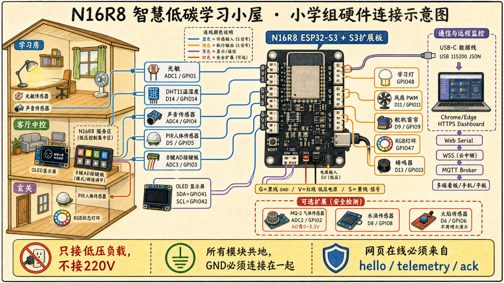

# N16R8 小学组智慧生活开发文档

项目名：`N16R8 智慧低碳学习小屋`
项目画像：`smartlife-primary-study-home-v1`
日期：2026-07-11
主控：`N16R8 ESP32-S3 + S3 传感器扩展板`
推荐路线：`USB 串口 JSON + HTTPS Web Serial + WSS/MQTT + Dashboard`

## 1. 项目目标

本项目面向小学组智慧生活赛项，不做“智能家居大全”，而是做一个能让评委一眼看懂的学习空间智能助手：

```text
小学规则主线：数据采集 -> 智能控制 -> 语音交互 -> 节能响应
真实硬件主线：N16R8 ESP32-S3 -> 光/DHT/声/PIR -> 学习灯(D12/GPIO12)/蜂鸣器/OLED
展示增强主线：Web Serial -> WSS Relay -> MQTT -> 可视化 Dashboard
```

验收时必须看到同一条闭环：

```text
传感器变化 -> N16R8 本地判断 -> 执行器动作 -> OLED/网页同步 -> 语音或网页可控
```

完成标准不是“网页能打开”或“图画得漂亮”，而是评委能同时看见：

- 生活问题、实体模型、N16R8 模块和网页状态一一对应。
- 开发板输出真实 `hello / telemetry / health / ack` JSON；Dashboard 不用占位数据假装在线。
- 同一控制可通过网页按钮、语音白名单和公网预览路线看到结果。
- 告警必须说明原因、来源 GPIO、当前值/阈值和实际采取的动作。
- 文档、连线图、固件、Dashboard、演示脚本与当前硬件一致。
- 至少验证一次无板 mock 路径和一次真实开发板路径。

## 2. 当前资料

| 文件/目录 | 用途 |
| --- | --- |
| `设计方案.md` | 小学组规则审计、方案定位、硬件合同、MQTT/可视化设计。 |
| `assets/wiring/n16r8-primary-wiring.png` | image 模型生成的硬件连接示意图，用于讲解和总览。 |
| `assets/wiring/prompts/n16r8-primary-wiring.md` | 连线示意图生成提示词，后续可复用再出图。 |
| `infographic/smartlife-primary-house/infographic.png` | 小学组任务映射信息图。 |
| `三个规则视频表述分析报告_副本2.md` | 规则视频表达方式分析。 |
| `三个视频任务要素重点注意详析_副本2.md` | 小学组任务要素拆解。 |

连线示意图：



注意：图片用于讲解与布线总览；旧图可能仍含 8键AD、RGB、风扇、舵机或 GPIO48 继电器标注。当前实物没有这些模块，且学习灯/继电器已按实板照片改接 `D12 / GPIO12`；如果图片局部小字与本文表格不一致，以本文表格和实板丝印复核为准。

## 3. 硬件连接合同

### 3.1 扩展板接线规则

N16R8 S3 扩展板使用白色 `G-V-S` 插槽：

| 标记 | 含义 | 常见线色 |
| --- | --- | --- |
| `G` | `GND` | 黑线 |
| `V` | 低压电源 | 红线 |
| `S` | GPIO 信号 | 黄线/白线 |

硬规则：

- 所有模块必须共地。
- ESP32-S3 的信号输入不要超过 `3.3V`。
- 继电器只接低压演示负载，不接 `220V`。
- 上电默认：继电器关、蜂鸣器静音。
- “蜂鸣器物理静音”不等于“安全提醒关闭”；安全提醒默认启用，只有明确下发 `set.buzzerEnabled=false` 才视为静音安全提醒。
- 接线前断电，全部插好后再 USB 上电。

### 3.2 小学组核心模块

| 分组 | 模块 | 扩展板接口/GPIO | 放置位置 | 作用 |
| --- | --- | --- | --- | --- |
| 感知 | 光敏传感器 | `ADC1 / GPIO1` | 学习房窗边/书桌上方 | 数据采集、光暗开灯、节能判断 |
| 感知 | DHT11 温湿度 | `D14 / GPIO14` | 客厅中部 | 温度阈值、舒适提醒、OLED/网页提示 |
| 感知 | 声音传感器 | `ADC4 / GPIO4` | 学习房靠外墙 | 学习噪声提醒 |
| 感知 | PIR 人体红外 | `D5 / GPIO5` | 玄关入口 | 有人/无人、离家提醒、节能响应 |
| 执行 | 继电器/学习灯 | `D12 / GPIO12` | 学习房书桌 | 学习灯开关或低压灯带；当前实板替代原 `GPIO48` |
| 执行 | 无源蜂鸣器 | `D13 / GPIO13` | 玄关/中控旁 | 噪声或异常短提醒 |
| 显示 | OLED | `SDA=GPIO41, SCL=GPIO42` | 底板前侧 | 本地数据显示和模式反馈 |

当前实物裁剪：没有 8键AD、RGB 灯带、风扇和舵机。模式切换由 Dashboard 按钮和语音白名单完成；阈值调整由 Dashboard 阈值表单完成；状态反馈由 OLED、网页、学习灯和蜂鸣器承担。`GPIO12` 已用于学习灯/继电器，不再作为风扇方向口。

### 3.3 可选安全扩展

| 模块 | 接口/GPIO | 说明 |
| --- | --- | --- |
| MQ-2 烟雾/燃气 | `ADC2 / GPIO2` | 若模块用 `5V` 供电，`AO` 必须分压/限压到 `0~3.3V` 后进 ADC。 |
| 水滴传感器 | `D8 / GPIO8` | 漏水提醒扩展，只滴少量水并垫透明膜。 |
| 火焰传感器 | `D6 / GPIO6` | 火源提醒扩展，不用明火演示，用安全光源或按钮模拟。 |

### 3.4 线束颜色建议

| 线束 | 模块 | 建议颜色 | 走线 |
| --- | --- | --- | --- |
| 感知线束 | 光敏、DHT11、声音、PIR | 蓝色 | 模型孔位 -> 底板下线槽 -> N16R8 |
| 执行线束 | 学习灯、蜂鸣器 | 橙色 | 执行器 -> 底板下线槽 -> N16R8 |
| 显示/通信线束 | OLED、USB、Web Serial/MQTT | 紫色 | 前侧屏幕/右侧服务区 -> N16R8 |
| 安全扩展线束 | MQ-2、水滴、火焰 | 红色 | 厨卫/扩展区 -> 右侧服务区 |

## 4. 场景与小学任务映射

| 小学组任务 | 现场动作 | 评委看到 |
| --- | --- | --- |
| 数据采集 | 遮挡光敏、热水杯靠近 DHT、拍手、PIR 前挥手 | OLED 和网页同步显示光照、温湿度、噪声、人体状态 |
| 智能控制 | 学习模式下遮光、升温或拍手 | 学习灯自动亮；温度/噪声触发 OLED/网页提醒和蜂鸣器短提醒 |
| 语音交互 | 说“开始学习”“开启节能”“现在光线怎么样” | 模式切换或状态回读，网页语音记录出现 |
| 节能响应 | 开启节能后离开 PIR 范围，或让光照充足 | 学习灯关闭，节能分和节能原因显示 |

## 5. 模式设计

| 模式 | 触发方式 | 自动逻辑 | 执行反馈 |
| --- | --- | --- | --- |
| `study` 学习 | 网页按钮、语音“开始学习” | 光暗开灯；温度高或噪声高短提醒 | 学习灯、蜂鸣器、OLED、网页 |
| `rest` 休息 | 网页按钮、语音“我要休息” | 关闭学习灯，噪声提醒静默 | OLED、网页 |
| `away` 离家 | 网页按钮、语音“我要出门” | 关闭灯；PIR 有人则提醒 | 蜂鸣器短报警、OLED、网页告警 |
| `energy` 节能 | 网页按钮、语音“开启节能” | 无人或光照足时关灯 | 节能分、节能原因、OLED、网页 |

## 6. 最小硬件控制合同

| 功能 | 实现方式 |
| --- | --- |
| 模式切换 | Dashboard 模式按钮、语音白名单意图 |
| 阈值调整 | Dashboard 阈值表单下发 `lightThreshold`、`temperatureThreshold`、`soundThreshold` |
| 本地反馈 | OLED 显示模式、阈值、传感器、学习灯和蜂鸣器状态 |
| 现场提示 | 学习灯、蜂鸣器和网页事件记录 |

固件不读取 `GPIO3` 作为 8键AD，不声明 `GPIO47` RGB，也不声明风扇或舵机。评委需要看到模式和阈值变化时，看 OLED 与 Dashboard 即可。学习灯/继电器当前使用 `D12 / GPIO12`。

安全与提醒语义必须保持一致：

- `actuator.buzzer=false` 只停止手动测试蜂鸣，不关闭自动安全提醒。
- `set.buzzerEnabled=false` 才是显式静音安全提醒，`telemetry.health` 或 `health` 帧要能看出当前是 `enabled` 还是 `muted`。
- 当前无风扇、RGB 和舵机，告警动作只允许写成 Dashboard/OLED/蜂鸣器/学习灯这些真实存在的反馈。
- 如果后续加 MQ-2、水滴或火焰扩展，仍然先做低压安全演示；动作摘要不得凭空写“风扇 100%”或“RGB 红”。

## 7. 串口 JSON 协议

串口速率固定为 `115200`。每行一个 JSON，不混入调试 prose。调试信息如必须输出，请放到单独开关，不进入正式演示固件。正式协议要保留 `hello`、`telemetry`、`health`、`command`、`voiceIntent`、`ack` 这些类型；当前最小固件可以把 `health` 放在 `telemetry.health` 中，后续网关或固件也可以单独发 `health` 帧。

### 7.1 hello

```json
{"type":"hello","project":"smartlife-primary","board":"n16r8_esp32s3","profileId":"smartlife-primary-study-home-v1","firmware":"0.1.0","deviceName":"N16R8 智慧低碳学习小屋","baud":115200,"capabilities":["webSerial","mqttBridge","dashboard","voiceIntent","energyScore"],"pins":{"light":1,"sound":4,"dht":14,"pir":5,"lamp":12,"buzzer":13,"oledSda":41,"oledScl":42}}
```

### 7.2 telemetry

```json
{"type":"telemetry","ts":123456,"mode":"study","sensors":{"light":31,"sound":22,"temperature":28.2,"humidity":55,"pir":true},"actuators":{"lamp":true,"buzzer":false},"alerts":[],"energy":{"score":82,"reason":"光线不足，开启学习灯；有人在房间，保持舒适提醒"},"display":{"lines":["N16R8 PRIMARY","MODE:STUDY","TH:L35 T29 S65","L:31 T:28 S:22","PIR:ON LAMP:ON","TEMP:OK BZ:OFF"]},"health":{"profileId":"smartlife-primary-study-home-v1","mqtt":"bridge","voice":"ready","oled":"ready","buzzerEnabled":true,"relaySafety":"lowVoltageOnly"}}
```

### 7.3 command / ack

```json
{"type":"command","mode":"study"}
{"type":"command","mode":"energy"}
{"type":"command","set":{"lightThreshold":35}}
{"type":"command","set":{"temperatureThreshold":29}}
{"type":"command","set":{"buzzerEnabled":false}}
{"type":"command","actuator":{"lamp":false}}
{"type":"command","actuator":{"buzzer":false}}
{"type":"voiceIntent","intent":"queryLight"}
{"type":"ping"}
```

固件收到命令必须返回：

```json
{"type":"ack","ok":true,"message":"mode=energy"}
```

### 7.4 health

`health` 用来说明链路和安全状态，不替代传感器数据。Dashboard 可以用它显示 USB/WSS/MQTT/语音/OLED 状态，但不能因为收到 `health` 就伪装成传感器在线。

```json
{"type":"health","ts":123456,"profileId":"smartlife-primary-study-home-v1","usb":"webSerial","mqtt":"bridge","voice":"textOnly","oled":"ready","buzzerEnabled":true,"relaySafety":"lowVoltageOnly"}
```

### 7.5 alerts 与模式传感器状态

橙色提醒和红色报警只能来自新鲜的 `telemetry.alerts`，不能直接由原始传感器值在网页上猜出来。Dashboard 使用本地 iOS 线性风格图标显示传感器状态，不依赖外部图标服务；颜色语义固定为：蓝色表示当前模式正在使用，橙色表示舒适提醒，红色表示安全报警。报警或提醒解除后，卡片恢复当前模式的蓝色高亮。

模式与传感器映射如下：

| 模式 | 蓝色高亮传感器 | 说明 |
| --- | --- | --- |
| `study` 学习 | 光照、温度、湿度、噪声 | 对应学习环境采集和舒适提醒。 |
| `rest` 休息 | 无 | 传感器仍可显示实时数据，但不突出自动控制。 |
| `away` 离家 | 人体 | 突出玄关 PIR 安防监测。 |
| `energy` 节能 | 光照、人体 | 对应“光暗 + 有人/无人”的节能判断。 |

切换模式时，仅让新模式对应图标短暂闪动；持续收到同一模式的 `telemetry` 不重复启动动画。当前核心告警建议：

| 告警码 | 来源 | 说明与动作 |
| --- | --- | --- |
| `noise` | 声音 `GPIO4` | 学习模式噪声超过阈值；显示当前值/阈值，蜂鸣器短提醒或网页/OLED 提醒。 |
| `temperature` | DHT11 `GPIO14` | 温度超过舒适阈值；显示当前温度/阈值，网页/OLED 提醒。 |
| `intrusion` | PIR `GPIO5` | 离家模式检测到人体活动；网页/OLED 告警，蜂鸣器按 `buzzerEnabled` 状态提醒。 |
| `mq2` / `gas` | 可选 MQ-2 `GPIO2` | 烟雾/燃气值超过阈值；必须写明当前值/阈值，动作只写当前真实硬件能做到的提醒。 |
| `water` | 可选水滴 `GPIO8` | 检测到漏水；网页/OLED/蜂鸣器提醒。 |
| `flame` | 可选火焰 `GPIO6` | 检测到火焰或安全模拟信号；网页/OLED/蜂鸣器提醒。 |

每条提醒或报警必须显示中文名称、触发原因、传感器名称和 GPIO 来源；噪声、温度还要显示当前值与页面阈值。联动动作只能描述当前实物存在的学习灯、蜂鸣器、OLED 和网页，不写风扇、RGB 或舵机。未知码必须保留，例如 `设备上报异常：<code>`，不能静默丢弃。没有新鲜 `telemetry` 时显示“等待实时数据”或“离线/重连中”，不得显示假正常或旧报警。

## 8. MQTT 与 Web Serial 路线

推荐第一阶段使用：

```text
N16R8 USB -> HTTPS Dashboard Web Serial -> WSS Cloud Relay -> MQTT Broker -> 其他电脑/手机 Dashboard
```

原因：

- 换电脑时只需要插 USB、用 Chrome/Edge 打开 HTTPS 网页、点击连接串口。
- 不把 Wi-Fi 和 MQTT 密码写死进固件。
- Safari/iPhone 可观看 Dashboard，但不作为 USB 直连网关。
- 插着 USB 的浏览器页面必须保持打开，这是该路线的明确代价。
- Chrome/Edge 的 Web Serial 页面会占用串口；如果后续烧录失败，先断开网页串口或关闭该标签页。

公网部署建议使用隔离端口，不影响服务器上已有系统：

| 端口/路径 | 角色 |
| --- | --- |
| `19167` | Dashboard 静态服务 |
| `19166` / `/smartlife-primary-ws` | WSS Cloud Relay |
| `19168` / `/api/voice/` | HTTPS 语音转写/意图 API，创建后再启用 |
| `19183` | MQTT Broker |

小学组 topic 前缀：

```text
smartlife/primary/n16r8/hello
smartlife/primary/n16r8/telemetry
smartlife/primary/n16r8/event
smartlife/primary/n16r8/health
smartlife/primary/n16r8/command
smartlife/primary/n16r8/config
smartlife/primary/n16r8/voiceIntent
```

## 9. 推荐工程结构

```text
.
├── AGENTS.md
├── 开发文档.md
├── 设计方案.md
├── assets/
│   └── wiring/
│       ├── n16r8-primary-wiring.png
│       └── prompts/n16r8-primary-wiring.md
├── firmware/
│   ├── platformio.ini
│   └── src/main.cpp
├── dashboard/
│   ├── index.html
│   ├── app.js
│   ├── intent-core.js
│   ├── style.css
│   └── sw.js                  # 如启用 PWA 缓存再创建
├── tools/
│   ├── n16r8_gateway.py
│   ├── n16r8_cloud_relay.py
│   └── voice_transcribe_server.py # 接 HTTPS STT 时再创建
└── docs/
    └── 公网USB网关部署方案.md
```

当前仓库已有 `firmware/`、`dashboard/` 和 `tools/` 的最小实现；新增文件前先检查现有结构，不要另起一套平行工程。

## 10. GitHub 更新节奏

远端仓库：`https://github.com/lostmyukii/zhihuishenghuohkxiao1.git`  
主分支：`main`

后续开发按“一个可验证步骤 = 一个提交 = 一次 push”推进：

| 步骤类型 | 应提交文件 | 推送前检查 |
| --- | --- | --- |
| 文档更新 | `AGENTS.md`、`开发文档.md`、`设计方案.md` | 图片路径存在；关键 GPIO、协议、任务映射可检索 |
| 固件最小版 | `firmware/platformio.ini`、`firmware/src/main.cpp` | `pio run -d firmware`；串口输出 `hello` |
| Dashboard 最小版 | `dashboard/index.html`、`dashboard/app.js`、`dashboard/intent-core.js`、`dashboard/style.css` | `node --check dashboard/app.js`；`node --check dashboard/intent-core.js`；离线状态不假在线 |
| WSS/MQTT 网关 | `tools/n16r8_gateway.py`、`tools/n16r8_cloud_relay.py` | `python3 -m py_compile tools/*.py`；topic 前缀为 `smartlife/primary/n16r8` |
| 语音/意图 | Dashboard 语音入口、服务端转写或规则文件 | 文本意图先通过；危险动作必须走白名单 |
| 实体模型/图片 | `assets/`、`docs/` 中对应素材 | 图片说明与硬件合同一致；差异写入文档 |

提交习惯：

```bash
git status --short
git add <本步骤相关文件>
git commit -m "<type>: <本步骤说明>"
git push
```

不要把 `.vscode/`、`.baoyu-skills/`、API key、MQTT 密码、Wi-Fi 密码和个人聊天记录提交到 GitHub。

## 11. 实施顺序

1. 固件最小版：GPIO 初始化、上电安全、传感读取、模式逻辑、`hello/telemetry/health/ack`。
2. 看板最小版：Web Serial 连接、在线状态、传感器卡片、执行器状态、模式按钮。
3. MQTT/WSS：复用初中路线，topic 前缀改为 `smartlife/primary/n16r8`。
4. 语音入口：先做文本/快捷按钮和白名单意图，再接 HTTPS STT。
5. 最小硬件收缩：完成 OLED/网页同步、网页阈值调整、语音/按钮模式切换。
6. 实板验证：USB 识别后烧录/监视串口，遮光、拍手、升温、PIR、D12 学习灯/继电器逐项验证。
7. 实体模型：按本文硬件合同布线，藏线、贴标签；旧图如有 8键/RGB/风扇/舵机标注则忽略。
8. 演示脚本：采集、控制、语音节能、MQTT 同步四段连贯演示。

## 12. 验证清单

文档/图纸：

- `assets/wiring/n16r8-primary-wiring.png` 已存在，开发文档可打开图片。
- 图片与本文硬件合同总体一致；若局部小字不一致，以本文表格为准。
- `AGENTS.md` 已写明不可假在线、不可接 220V、不可混串口 JSON。

固件：

- `pio run -d firmware` 成功。
- 串口 `115200` 首先输出 `hello`。
- 每行 `telemetry` 是合法 JSON。
- 能看到 `telemetry.health` 或单独 `health` 状态。
- 命令返回 `ack`。
- 上电后 D12 学习灯/继电器默认关闭，蜂鸣器默认不响。

网页：

- 无真实 `hello/telemetry` 时显示离线或等待，不显示假在线；仅收到 `health` 也不能伪装成传感器在线。
- 四种模式的 iOS 风格传感器图标按 7.5 节映射高亮；模式切换闪动结束后保持蓝色工作状态。
- `noise`、`temperature` 显示橙色提醒，`intrusion` 和可选安全告警显示红色报警，并展示中文原因、GPIO 来源和当前真实联动动作。
- `telemetry.alerts` 清空后立即解除橙色/红色状态；遥测超时后清除旧报警并显示“等待实时数据”。
- Chrome/Edge 可授权 CH340/USB 串口。
- Safari/iPhone 只能观看公网状态，不作为 USB 直连网关。
- 断开 USB 后显示离线/重连中。
- 文本语音意图通过白名单；自由文本不能直接控制危险动作。
- 如创建 `dashboard/sw.js`，改 JS 时同步更新 `index.html` 脚本版本和 `CACHE_NAME`。

可运行检查按已有文件执行：

```bash
node --check dashboard/app.js
node --check dashboard/alert-core.js
node --check dashboard/intent-core.js
node dashboard/tests/alert-core.test.js
node dashboard/tests/voice-intent.test.js
python3 -m py_compile tools/n16r8_gateway.py tools/n16r8_cloud_relay.py tools/ws_json.py
PYTHONPATH=tools python3 -m unittest tools/test_gateway.py
/Users/yukii/.platformio/penv/bin/pio run -d firmware
```

创建对应文件后再追加：

```bash
node --check dashboard/sw.js
python3 -m py_compile tools/voice_transcribe_server.py
```

mock 路径：

- `python3 tools/n16r8_gateway.py --mock-board --ws-port 18766` 能持续发数据。
- Dashboard 能显示 mock 数据、下发模式/阈值命令并收到 `ack`。

演示：

- 遮光、升温、拍手、PIR 都能让 OLED/网页变化。
- 学习模式能自动开灯，并能用蜂鸣器提醒噪声/温度异常。
- 节能模式能关闭学习灯并说明原因。
- 语音失败时，文本测试仍可演示同一条意图链。
- 真实开发板路径要看到 `hello`、`telemetry`、`ack`，并确认 D12 继电器/学习灯动作；如果系统看不到 USB 串口，先换数据线、检查驱动，并关闭可能占用 Web Serial 的 Chrome/Edge 标签页。

## 13. 常见错误

- 看到旧图或初中代码后，把 `GPIO12` 又当成风扇方向口，和当前学习灯/继电器冲突。
- 把旧版 `GPIO48` 继电器标注继续写进代码或演示词，忽略实板照片中找不到该接口。
- 把 8键AD、RGB、风扇、舵机重新写成当前核心验收项。
- 用公共 MQTT demo 数据冒充真实板在线。
- 串口里混入中文调试文本导致 Dashboard JSON 解析失败。
- 继电器接入 `220V`。
- 只画漂亮图，不让真实传感器和网页状态对上。
- 小学作品堆太多传感器，反而讲不清四项任务映射。
- 用 `actuator.buzzer=false` 当成全局静音，导致安全提醒被误关。

## 14. 实板验收记录

### 2026-07-11：USB/Web Serial 与 D12 网页控制

测试环境：`LY-AS-ESP32-S3 v1.2` 扩展板、CH340 USB 串口、Chrome Dashboard、`115200` 单行 JSON。

| 验收项 | 结果 | 现场证据 |
| --- | --- | --- |
| USB 串口识别与固件烧录 | 通过 | 开发板可通过 CH340 串口烧录并持续输出数据。 |
| `hello / telemetry / ack` | 通过 | Dashboard 收到实时帧，网页命令能收到固件确认。 |
| 网页“打开学习灯” | 通过 | 网页下发 D12 开灯命令，继电器/学习灯发生实体动作。 |
| 网页“关闭学习灯” | 通过 | 网页下发 D12 关灯命令，继电器/学习灯发生实体动作。 |
| D12/GPIO12 实板映射 | 通过 | 当前实板确认 `D12 / GPIO12` 可作为学习灯/继电器信号口。 |

本检查点证明以下真实链路已经打通：

```text
Dashboard 按钮 -> Web Serial command -> N16R8 固件 -> D12/GPIO12 -> 继电器/学习灯实体动作 -> ack
```

### 2026-07-11：GPIO1 光敏自动控制 D12 学习灯

测试模式：Dashboard 切换到 `study` 学习模式，手动遮挡与放开 `ADC1 / GPIO1` 光敏传感器。

| 验收项 | 结果 | 现场证据 |
| --- | --- | --- |
| 学习模式切换 | 通过 | Dashboard 模式切换生效，固件进入 `study`。 |
| GPIO1 光照采集 | 通过 | 遮挡与放开光敏传感器时，Dashboard 光照值发生对应变化。 |
| 光暗自动控制 | 通过 | 光照跨过当前阈值后，固件自动改变 D12 学习灯状态。 |
| 网页与实体同步 | 通过 | Dashboard 灯状态、节能原因与继电器/学习灯实体动作一致。 |

本次为用户实板手动验收通过，未记录具体光照数值区间；后续模型定型时应再记录明亮值、遮挡值和最终光照阈值，便于比赛现场稳定复现。

本检查点证明以下小学组任务链已经打通：

```text
遮挡/放开 GPIO1 -> 真实光照 telemetry -> 学习模式阈值判断 -> D12 学习灯自动开关 -> Dashboard/实体同步
```

### 2026-07-12：GPIO4 噪声提醒与 GPIO5 离家人体报警

测试环境：实板通过 `/dev/cu.usbserial-120` 接入 Chrome Web Serial；Dashboard 显示开发板在线，使用真实 `telemetry.alerts`、蜂鸣器和 OLED 状态验收。

| 验收项 | 结果 | 现场证据 |
| --- | --- | --- |
| `GPIO4` 学习噪声提醒 | 通过 | `study` 模式拍手触发后，网页噪声卡片变橙色并显示“学习噪声提醒”“声音 · GPIO4”。 |
| 噪声提醒实体联动 | 通过 | 蜂鸣器响；OLED 显示 `MODE:STUDY` 和 `BZ:ON`。 |
| 噪声提醒解除 | 通过 | 停止触发后，橙色提醒和蜂鸣器自动解除，网页恢复当前模式状态。 |
| `GPIO5` 离家人体报警 | 通过 | `away` 模式在 PIR 前活动后，人体卡片变红并显示“离家人体报警”“PIR · GPIO5”。 |
| 离家报警实体联动 | 通过 | 蜂鸣器响、学习灯保持关闭；OLED 显示 `MODE:AWAY`、`PIR:ON` 和 `BZ:ON`。 |
| 离家报警解除 | 通过 | 停止活动并等待 PIR 恢复后，红色报警与蜂鸣器自动解除。 |

本次由用户逐项观察实板、网页、蜂鸣器和 OLED 后确认全部正确，证明以下两条真实任务链已经打通：

```text
GPIO4 声音超过阈值 -> telemetry.alerts=["noise"] -> 网页橙色中文提醒 -> 蜂鸣器/OLED 同步
GPIO5 PIR 检测到人体 + away 模式 -> telemetry.alerts=["intrusion"] -> 网页红色中文报警 -> 关灯/蜂鸣器/OLED 同步
```

### 2026-07-12：energy 暗处 PIR 节能联动

测试模式：Dashboard 切换到 `energy` 节能模式，持续遮挡 `ADC1 / GPIO1` 光敏传感器，使光照低于 `35%` 页面阈值，再分别验证无人、有人和再次无人三种状态。

| 验收项 | 结果 | 现场证据 |
| --- | --- | --- |
| 暗处无人自动关灯 | 通过 | PIR 显示“无人”，D12 学习灯关闭，节能原因显示“无人，已自动关闭学习灯”。 |
| 暗处有人自动开灯 | 通过 | PIR 变为“有人”后，D12 继电器/学习灯自动开启。 |
| 节能状态不误报警 | 通过 | 光照和人体图标保持蓝色，页面没有离家人体报警，蜂鸣器保持静音。 |
| 有人时节能解释 | 通过 | 节能原因显示“节能模式正在根据光照和人体状态控制学习灯”，节能分约为 `90 分`。 |
| OLED 同步 | 通过 | 有人时显示 `MODE:ENERGY`、`PIR:ON`、`LAMP:ON`、`BZ:OFF`。 |
| 再次无人自动恢复 | 通过 | PIR 恢复“无人”后，D12 学习灯自动关闭，OLED 显示 `PIR:OFF`、`LAMP:OFF`、`BZ:OFF`。 |

本次由用户逐段观察并确认全部正确，证明节能响应闭环已经打通：

```text
暗处 + 无人 -> D12 关灯 -> 中文说明“无人，已自动关闭学习灯”
暗处 + 有人 -> D12 开灯 -> 蓝色模式状态 + 蜂鸣器静音
再次无人 -> D12 自动关灯 -> 节能原因/OLED/网页同步恢复
```

### 2026-07-12：DHT11 稳定采样与温度提醒

问题现象：DHT11 已正确接在 `D14 / GPIO14`，但网页温度、湿度持续显示“等待”。固件原先把 DHT11 与快速传感器一起每 `200ms` 读取，且单次失败就立即标记为 `missing`。

修复内容：固件 `0.1.2` 保留光敏、声音、PIR 的 `200ms` 快速采样；DHT11 改为 Adafruit DHT 驱动、`2000ms` 独立采样，短暂失败保留最近有效值，连续约 `6000ms` 失败才标记为 `missing`。

| 验收项 | 结果 | 现场证据 |
| --- | --- | --- |
| 固件烧录 | 通过 | `/dev/cu.usbserial-120` 烧录成功，所有写入区块哈希校验通过，`hello.firmware="0.1.2"`。 |
| DHT11 串口数据 | 通过 | 实板读到温度 `27.1 C`、湿度 `69.0%`、`health.dht="ok"`、OLED `ready`。 |
| Dashboard 温湿度 | 通过 | 网页显示温度 `27.1 C`、湿度 `70%`，不再显示“等待”。 |
| 快速传感器无回退 | 通过 | 同一页面中光照、噪声和人体仍持续实时更新。 |
| 温度提醒触发 | 通过 | `study` 模式把阈值临时设为 `26 C` 后，收到 `ack set=temperatureThreshold`，温度卡片变橙并显示当前 `27.1 C`、阈值 `26.0 C` 和 `DHT11 · GPIO14`。 |
| 实体提醒同步 | 通过 | 蜂鸣器响；OLED 显示 `TEMP:HI`、`BZ:ON`。 |
| 默认状态恢复 | 通过 | 阈值恢复为 `29 C` 后，橙色提醒解除、蜂鸣器静音，OLED 恢复 `TEMP:OK`、`BZ:OFF`。 |

本检查点证明 DHT11 数据采集与学习舒适提醒链已经打通：

```text
GPIO14 DHT11 -> 2s 稳定采样 -> telemetry 温湿度 -> Dashboard/OLED 同步
当前温度 >= 学习阈值 -> telemetry.alerts=["temperature"] -> 橙色中文提醒 -> 蜂鸣器/OLED 同步
```

下一检查点：使用第二台电脑或手机打开 Dashboard，验证 USB 电脑通过 WSS/MQTT 转发真实 `telemetry`，远端页面能同步看到模式、传感器、提醒和执行器状态。
